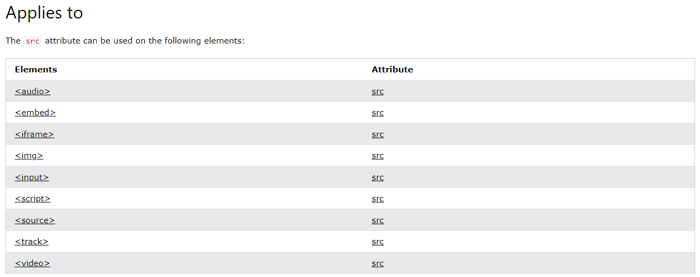
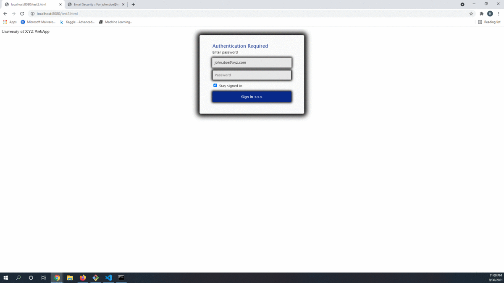

# [Machine Learning Security Evasion Competition 2021](https://mlsec.io/)
## Anti-Phishing Evasion Track

The dawn of the digital age has unleashed the Captain Ahab's upon the sea's of the cyber world and its great white whale is root on your machine.  While most of the time many play the role of the great white whale attempting to thwart the ever relenting Ahab's of the world from trying to harpoon their way into networks, we rarely if ever get to take on that opposing role.  Howeber this competition allows got individuals to take on the role of the adversary.  Within this competition 10 phishing samples are supplied and the goal of each participant is to devise a method to bypass the 7 machine learning models trained to detect phioshing sites.  Every method must recreate an exact pixel for pixel representaion of the phishing site within a Chromium based browser running within the competition's sandbox.  So with these simple rules set let the phishing begin.

First and foremost sspecial thanks to [Dr. Hyrum Anderson](https://twitter.com/drhyrum?lang=en) from Microsoft and [Zoltan Balazs](https://twitter.com/zh4ck?lang=en) from CUJO AI for organizing this one of kind competition.  Also a shout out to the sponsors who helped support and make this competition possible [CUJO AI](https://twitter.com/CUJOAI), [Microsoft](https://twitter.com/Microsoft), [MRG Effitas](https://twitter.com/mrgeffitas), [NVIDIA](https://twitter.com/nvidia) and [VMRay](https://twitter.com/vmray).

## 1. Strategy ##
The overall strategy to defeat the anti-phishing models combined a base64 encoding of the phishing site which would then be embedded and self-extracted within a benign template.  In order to achieve FUD this strategy was broken down into 3 distinct parts.
1. Devise method utlizing javascript to recreate the phishing page
2. Find benign html template which would bypass all 7 anti-phishing models
3. Incrementally combine the deployment method with the benign html template

Overall I was aiming for a plug and play method which could be used for every phsihing site and one which would mitigate the overall manual configuration needed to fully bypass the models.

## 2. Deployment Method ##

In order to deploy the base64 encoded phishing site a method would need to be devised to extract and overlay the benign template with the phishing site.  The `src` HTML attribute intially seemed to be the most promising method since a bae64 encoded string could be converted to a `text/html` blob and injected into an element with this attribute.  Doing a little research led to an assortment of HTML tags that utilized this attribute in some capacity.  
<br>
<br>
<p align="center">

</p>
<br>
<br>

After some trial and error it became evident that the only viable HTML elements that would recreate the original phishing site with a high degree of fidelity were the `iframe` and `embed` tags.  This method was tested with some simple javascript and an iframe within an HTML file.  The "junk" or "benign" elements within the file would be effectively removed and replaced with an iframe that would render the phishing site in its place.  
<br>
<br>

```javascript
<script>
    document.getElementById('junk').style.display = 'none';
    let s = decodeURIComponent(escape(window.atob(<base64 encoded file>))
    let blob = new Blob([s], {type : "text/html"});

    var reader = new FileReader();

    reader.addEventListener("loadend", function(e){
        document.getElementById("test").src = e.srcElement.result;
    });

    reader.readAsDataURL(blob)
</script>
```

<br>
<br>

While this method appeared to be fulfilling the requisite technical needs for this method to be viable there was however a fatal flaw that would ultimately lead to scrapping of this technique.  Displayed below are two images of the `01.html` phishing site.  One image is of the recreated phishing site using an iframe and the other is the original file displated out of the box.  The images appear to be identical however when the screenshot images taken via `chrome --headless` are hashed they do not match.  The `iframe` renders the data in a slighly different manner and thus some minor pertubations can be observed, but not by the human eye.  Even if this method is off by just 1 pixel this method is no longer viable and must be abandoned.  So back to the drawing board.  

<br>
<br>
<p align="center">

</p>
<br>
<br>

The javascript method `document.write()` can be used but I was originally a bit hesitant to use this method since since some of the phishing files utilize this same javascript and it might trigger the anti-phishing models to flag my file.  This method proved to be an option when both hashes matched.

<br>
<br>

```javascript
<script>
    document.getElementById('junk').remove();
    let s = decodeURIComponent(escape(window.atob( <base64 encoded phishing site> )));
    document.write(s);
</script>
```

<br>
<br>
Now that a method has been devised to recreate the phishing site a benign template would need to be found to fool the anti-phishing models into not flagging the file.

## 3. Searching for a Benign Template ##
In order for this technique to work i would need a benign baseline to the javscript deployment method with.  Intially I though this would be relatively easy finding an HTML file that would be able to bypass all 7 of the anti-phishing models, but this proved to be far more difficult than I aniticipated.  Originally I tried what I would assume to be anodyne HTML files such as microsoft.com, espn.com. google.com and facebook.com, however none of these files were able to bypass all 7 of the anti-phishing models.  My next thoughts were "what would pass all 7 models"?  I tried Wikipedia pages translated to various languages, PE files, txt files, pics, gifs, high entropy files and others that have slipped my mind.  Ultimately out of frustration I decided to automate this process and hope for the best.  Ended up writing a script that would iterate through the [Majestic Million](https://majestic.com/reports/majestic-million) list of top sites to see if any of the home pages of these sites would have whatever X factor was needed to bypass these models.  Luckily not too far into the list the [Adobe](https://www.adobe.com/) website homepage had whatever special sauce was needed to not be flagged.  Shout out to the Adobe devs who are doing something differnt over there.  I have no idea as to why this particular HTML file would not be flagged nor what percentage of websites within that list would have been able to bypass all 7 anti-phishing models.  Now that a benign baseline has been found the integrating the malicious javascript can begin.
<br>
<br>
<p align="center">

</p>

## 4. Integration ##

Two separate parts now need to be combined in such a way that the encoded phishing site is still deployed with the same degree of fidelity as the original and so that the benign HTML file still bypasses all the anti-phishing models.  This was a slow process that consisted of a lot trial and error.  Incrementally make modifications to the benign file and see of the anti-phishing models would flag it.  While many variations were attempted two key issues stood out.  The first issue encountered was how to hide the all the benign elements so that only the phishinf HTML elements would be displayed.  My original idea was to encompasss the entire benign file within a `div` element and hide it immediately, but a `<div>` element spanning the entire HTML file would be flagged.  Through a trial and error process a sweet spot could be found via two `div` elements embedded in certain areas within the file.  Issue 1 solved and 1 to go.  The next issue was focused on where to place the base64 encoded phishing blob within the site.  Having it preset within the actual `<script>` element would trigger the anti-phishing model which they apprently did not like.  So once again through trial and error an area was discovered within the file which allowed for all 7 anti-phishing models to be bypassed.  This area happened to be the `class` attribute within a `<script>` element.
<br>
```html
...
<script id="yo" class="<ascii encoded phishing site>" type="text/javascript" src="/etc.titan.dexterlibs/homepage/clientlibs/publish.combined.fp-421c4c081baf214852bd975d300f5d39.js" defer></script>
</div>

<script>
    document.getElementById('junk1').remove();
    let x = document.getElementById('yo').className;
    document.getElementById('junk2').remove();
    let s = decodeURIComponent(escape(window.atob(x)));
    document.write(s);
</script>
 ```
